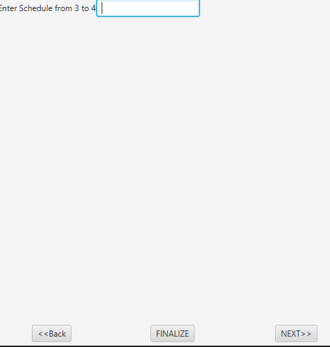
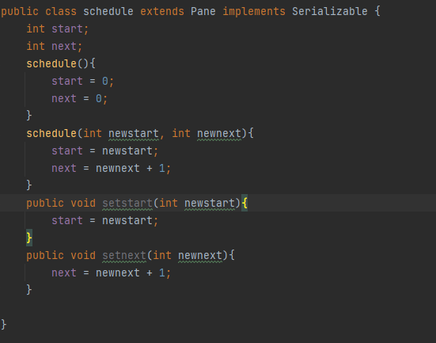

# Scheduler
## Synopsis
This is a easy way to schedule out a time.
## Motivation
I made the as my final project for a class because i wanted to improve upon my previous project
## How to Run
the files need to run are in project folder

## Code Example
I like this code because it was a way to get the start time for the viewer to see 

## Contributors

This code is Finished, however feel free to make desired improvements

contributors: Garron Haley

